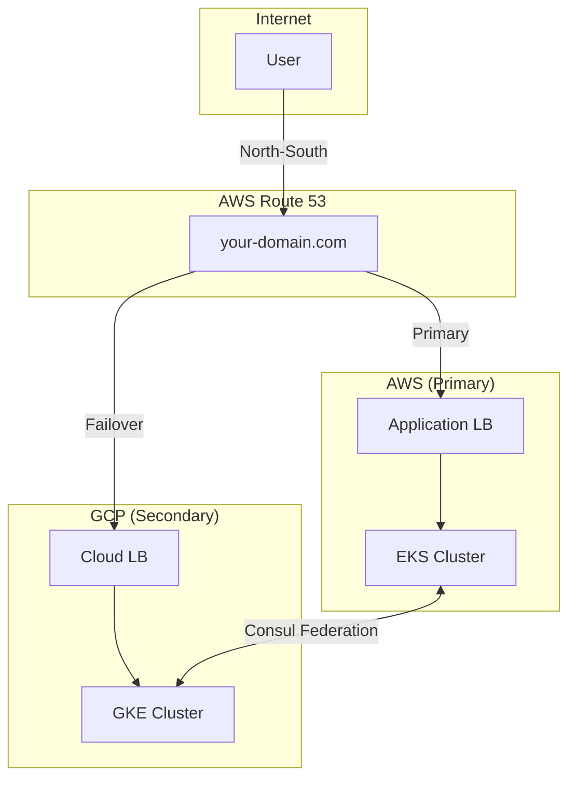

# Multi-Cloud Kubernetes with Terraform and Consul

This project provides a robust, minimal setup for a multi-cloud Kubernetes architecture spanning AWS and Google Cloud Platform (GCP). It uses Terraform for infrastructure provisioning, AWS Route 53 for DNS-based failover, and HashiCorp Consul for cross-cluster service discovery and service mesh capabilities.

The primary goal is to create a resilient Active-Passive setup where AWS serves as the primary region and GCP acts as a hot standby, with AWS Route 53 handling the failover.

## Core Architecture

The architecture is divided into two main traffic patterns:

1.  **North-South Traffic (User to Application):** Managed by AWS Route 53. User requests are directed to the primary AWS region (set as ap-south-1 in this example). If health checks for the AWS Application Load Balancer (ALB) fail, Route 53 automatically reroutes all traffic to the GCP Cloud Load Balancer.

2.  **East-West Traffic (Service-to-Service):** Managed by HashiCorp Consul. A federated Consul service mesh is deployed across both Kubernetes clusters. This allows services to communicate seamlessly with each other across cloud boundaries using consistent DNS names (e.g., `billing-api.service.consul`), regardless of which region is currently active.


---

## Directory Structure

```
├── consul/
│   ├── consul-aws-values.yaml      # Helm values for the primary AWS Consul datacenter
│   └── consul-gcp-values.yaml      # Helm values for the secondary GCP Consul datacenter
│
└── infra/
    ├── aws/                        # Terraform root module for all AWS resources
    ├── gcp/                        # Terraform root module for all GCP resources
    ├── dns/                        # Terraform root module for Route 53 failover records
    ├── global/                     # Terraform for global resources (Route 53 Zone, TF state backends)
    ├── modules/                    # Reusable Terraform modules (EKS, GKE, VPC, etc.)
    └── scripts/                    # Helper scripts for running Terraform
```

---

## Deployment Guide

Follow these steps to provision the entire multi-cloud environment.

### Prerequisites

1.  **Tools:**
    *   Terraform (`>= 1.0`)
    *   AWS CLI (`>= 2.0`)
    *   Google Cloud SDK (`gcloud`)
    *   `kubectl`
    *   `helm`
2.  **Configuration:**
    *   Ensure your AWS and GCP credentials are configured locally.
    *   Purchase a domain name and have it managed by AWS Route 53.

### Step 1: Global Backend Setup
 
This project uses a bootstrapping approach for Terraform state management. The `global` component is responsible for creating the remote backends (an S3 bucket in AWS and a GCS bucket in GCP) that will be used by all other components.
 
For this project, the `global` component itself will store its state **locally** in a `terraform.tfstate` file within the `infra/global/` directory.
 
**Note on Best Practices:** In a production or team environment, it is highly recommended to create the backend resources manually and configure a remote backend for the `global` component as well. This prevents the initial state from being tied to a single machine. However, for simplicity and ease of setup in this project, we use a local state for the initial bootstrapping.
 
No manual action is required here if you follow the scripts, but be aware of this design decision.

### Step 2: Provision Cloud Infrastructure

Use the provided scripts from the `infra/scripts` directory to deploy the infrastructure. This ensures all components are planned and applied in the correct order of dependency.

1.  **Plan all changes:**
    ```bash
    ./plan.sh staging
    ```
    Review the generated plans in each component directory (`../aws`, `../gcp`, etc.) to ensure the changes are expected.

2.  **Apply all changes:**
    ```bash
    ./apply.sh staging
    ```
    This will execute the plans created in the previous step.

### Step 3: Configure `kubectl`

After provisioning, configure `kubectl` to communicate with your new clusters.

*   **For EKS (AWS):**
    ```bash
    aws eks update-kubeconfig --region $(terraform -chdir=infra/aws output -raw region) --name $(terraform -chdir=infra/aws output -raw eks_cluster_name)
    ```
*   **For GKE (GCP):**
    ```bash
    gcloud container clusters get-credentials $(terraform -chdir=infra/gcp output -raw gke_cluster_name) --region $(terraform -chdir=infra/gcp output -raw region)
    ```

### Step 4: Deploy Consul Service Mesh

Consul is deployed using Helm after the infrastructure is ready. This process involves a few manual steps to securely link the two datacenters.

1.  **Get GCP Egress IPs:** Find the static outbound IP addresses of your GCP cluster. This is used to firewall the AWS Consul endpoint.
    ```bash
    terraform -chdir=infra/gcp output nat_egress_ips
    ```
    Copy the output and replace the placeholder IPs in `consul/consul-aws-values.yaml` under the `service.beta.kubernetes.io/aws-load-balancer-source-ranges` annotation.

2.  **Deploy Consul to AWS (Primary):** Switch your `kubectl` context to the EKS cluster.
    ```bash
    helm repo add hashicorp https://helm.releases.hashicorp.com
    helm install consul hashicorp/consul --values consul/consul-aws-values.yaml --namespace consul --create-namespace
    ```

3.  **Get AWS Consul Load Balancer Address:** Wait a few minutes for the AWS Load Balancer to be provisioned, then retrieve its address.
    ```bash
    kubectl get service consul-server -n consul -o jsonpath='{.status.loadBalancer.ingress[0].hostname}'
    ```
    Copy the output address (e.g., `xxxx.elb.us-east-1.amazonaws.com`).

4.  **Update GCP Consul Config:** Paste the AWS Load Balancer address into `consul/consul-gcp-values.yaml`, replacing the `<REPLACE_WITH_AWS_LOAD_BALANCER_ADDRESS>` placeholder in the `retry_join` block.

5.  **Deploy Consul to GCP (Secondary):** Switch your `kubectl` context to the GKE cluster.
    ```bash
    helm install consul-gcp hashicorp/consul --values consul/consul-gcp-values.yaml --namespace consul --create-namespace
    ```

### Step 5: Verify Consul Federation

Your multi-cloud service mesh is now operational. You can verify that the two datacenters are federated using the following methods.

1.  **Via the UI (from AWS cluster):**
    ```bash
    # Port-forward the Consul UI service
    kubectl port-forward service/consul-ui -n consul 8501:80
    ```
    Navigate to `http://localhost:8501` in your browser. You should see both `aws` and `gcp` datacenters in the dropdown menu at the top left.

2.  **Via the CLI (from any server pod):**
    ```bash
    # Exec into a Consul server pod in the AWS cluster
    kubectl exec -it consul-server-0 -n consul -- /bin/sh
    # Run the member command to see servers in both datacenters
    consul members -wan
    ```

---

## Technology Stack

*   **Cloud Providers:** AWS, Google Cloud Platform
*   **IaC:** Terraform
*   **Container Orchestration:** Amazon EKS, Google GKE
*   **DNS & Failover:** AWS Route 53
*   **Service Mesh:** HashiCorp Consul
*   **Databases:** Amazon RDS (Postgres), Amazon ElastiCache (Redis)
*   **Load Balancing:** AWS Application Load Balancer, GCP Global Cloud Load Balancer
*   **Ingress Controllers:** AWS Load Balancer Controller (for EKS), GKE Ingress Controller
